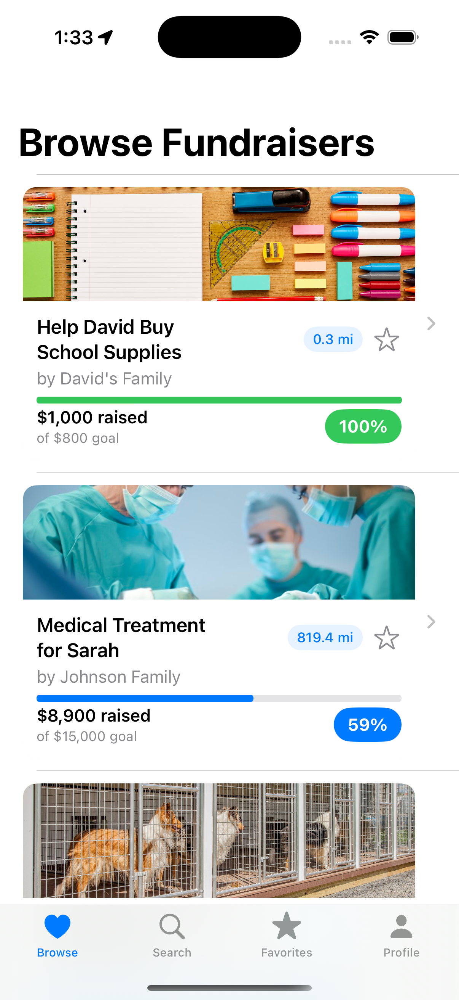

# DonateNear  
A SwiftUI app that helps users discover and donate to local fundraisers. Users can browse causes, search by category, save favorites, and make secure mock donations.  

**Built solo using SwiftUI.**

---

## 📱 Screens & Demo

<p align="center">
  
  
  
  
  
  
  
  
</p>

**Walkthrough:**  
1. Open the app → land on the welcome screen.  
2. Browse or search fundraisers → view details.  
3. Select a cause → donate with preset or custom amounts → confirm payment.  

---

## ✨ Features
- Animated welcome screen with app branding.  
- Browse fundraisers sorted by distance.  
- Search by keyword or category with filter chips.  
- View fundraiser details with progress tracking.  
- Save and manage favorites across sessions.  
- Step-by-step donation flow with payment confirmation.  

---

## 🛠 Skills
- Designed and implemented full app architecture in SwiftUI.  
- Built reusable SwiftUI views and components with previews.  
- Integrated CoreLocation to calculate user distance to fundraisers.  
- Managed app state with `@State` and `@Observable` properties.  
- Created navigation flows using `NavigationView` and `NavigationLink`.  
- Implemented a singleton manager for favorites persistence in memory.  
- Styled UI with gradients, capsules, and system SF Symbols.  
- Simulated payment processing with Swift concurrency (`DispatchQueue`).  

---

## ⚙️ Tech Stack
- **Language:** Swift 5+  
- **Frameworks:** SwiftUI, CoreLocation  
- **Xcode:** 15+  
- **iOS Target:** iOS 17+  
- **Swift Packages:** None (built entirely with native APIs)  

---

## 🚀 Setup
1. Clone this repository:  
   ```bash
   git clone https://github.com/yourusername/donatenear.git
   ```
2. Open DonateNear.xcodeproj in Xcode.
3. Build and run on a simulator or physical device (iOS 17+).
4. Explore using included sample fundraiser data.

## 🔮 Future Improvements
- Add persistent storage (Core Data or CloudKit) for favorites and donations.  
- Integrate real payment APIs (e.g., Stripe).  
- Expand fundraiser categories and live search results.  
- Add map integration to visualize nearby causes.  

---

## 🙏 Credits & Inspiration
- Built using [CodeDreams](https://codedreams.app/).  
- Icons: Apple SF Symbols.  

---

## 📄 License & Contact
**License:** MIT  

**Author:** Grant Li  
- [LinkedIn](https://linkedin.com/in/yourprofile)  
- Email: gli412@gatech.edu 
